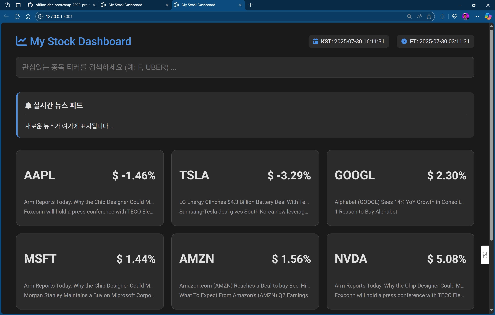

# 1팀 실시간 주식 동향 프로젝트

## 스크린샷



## 프로젝트 개요

한국 거주자를 위한 실시간 주식 동향 모니터링 시스템입니다. 숙면 시간 중 미국 주식시장을 파악하고, 투자한 종목과 즐겨찾기한 종목의 뉴스를 크롤링하여 설정한 기상 시간에 맞춰 중요 5개 항목을 표기하는 웹 애플리케이션입니다.

## 주요 기능

- **실시간 주식 모니터링**: 투자 종목 및 즐겨찾기 종목 추적
- **뉴스 크롤링**: 관련 뉴스 자동 수집 및 분석
- **시차 및 환율 정보**: 한국-미국 시차 및 실시간 환율 표시
- **스케줄링**: 10분 간격으로 데이터 업데이트
- **UI/UX**: 그리드/상세 뷰 전환 가능한 현대적 인터페이스
- **실시간 뉴스 피드**: 대시보드에 실시간 뉴스 카드 표시

## 개발 과정

### 초기 기획
- 한국 거주 가정
- 숙면 시간 중 미국 주식시장 파악
- 투자한 종목, 즐겨찾기한 종목 뉴스 크롤링
- 설정한 기상 시간에 맞춰 중요 5개 항목 표기
- 웹페이지로 제작
- 한국어로 진행

### 단계별 개발 진행
1. **1단계**: 초기 기획안 제시 및 동의
2. **2단계**: 기본 기능 구현 완료
3. **3단계**: 핵심 기능 추가 (시차, 환율)
4. **4단계**: 기능 대규모 확장
5. **5단계**: UI/UX 전면 개편

### 기능 확장 과정

#### 스케줄링 개선
- 스케줄 간격을 10분으로 변경
- 사용자 입력 키워드 관련 뉴스 추가
- UI/UX 개선

#### 키워드 번역 기능
- 한국어 키워드를 영어로 번역하여 미국 뉴스 검색
- 번역 기능 추가

#### 문제 해결 과정
- **cgi 모듈 오류**: 모듈 의존성 문제 해결
- **httpx 라이브러리 오류**: `ProxiesTypes` import 오류 해결
- **라이브러리 설치 문제**: 
  - `py-googletrans-free` 설치 실패
  - `google-trans-free` 라이브러리 부재
  - 의존성 충돌 해결

#### 기능 재설계
- 키워드 뉴스 기능 제거
- 종목별 뉴스 최상단에 현재 가격 추가
- 실행 파일 통합으로 편의성 개선

## UI/UX 개선 사항

### 레이아웃 변경
- 각 종목을 개별 카드 섹션으로 표현 (가로 3개, 세로 2개, 총 6개)
- 종목 카드 클릭 시 뉴스창으로 전환
- 카드 왼쪽 상단에 X 버튼 추가 (메인 화면 복귀)

### 시간 정보 표시
- 오른쪽 상단에 한국 날짜/시간, 미국 날짜/시간 표기

### 추가 기능
- **가격 차트**: 상세 뉴스 뷰 하단에 해당 종목 가격 관련 그래프
- **종목 제거**: 뉴스 상세페이지에서 메인화면 제거 기능
- **실시간 뉴스 피드**: 대시보드 종목 관련 뉴스 실시간 표시
- **뉴스 피드 위치**: 검색창 아래, 그리드 섹션 위로 배치

## 기술 스택

- **백엔드**: Python
- **웹 프레임워크**: Flask
- **데이터 수집**: 뉴스 크롤링
- **번역**: Google Translate API
- **프론트엔드**: HTML, CSS, JavaScript
- **스케줄링**: 자동 업데이트 시스템

## 데이터 출처

뉴스 기사는 다양한 금융 뉴스 소스에서 수집되며, 실시간으로 업데이트됩니다.

## 설치 및 실행

```bash
# 의존성 설치
pip install -r requirements.txt

# 애플리케이션 실행
python app.py
```

## 프로젝트 구조

```
my_stock_news/
├── app.py              # 메인 애플리케이션
├── config.py           # 설정 파일
├── requirements.txt    # 의존성 목록
├── templates/          # HTML 템플릿
│   └── index.html
├── assets/            # 정적 파일
├── *.json            # 캐시 및 데이터 파일
└── README.md         # 프로젝트 문서
```
